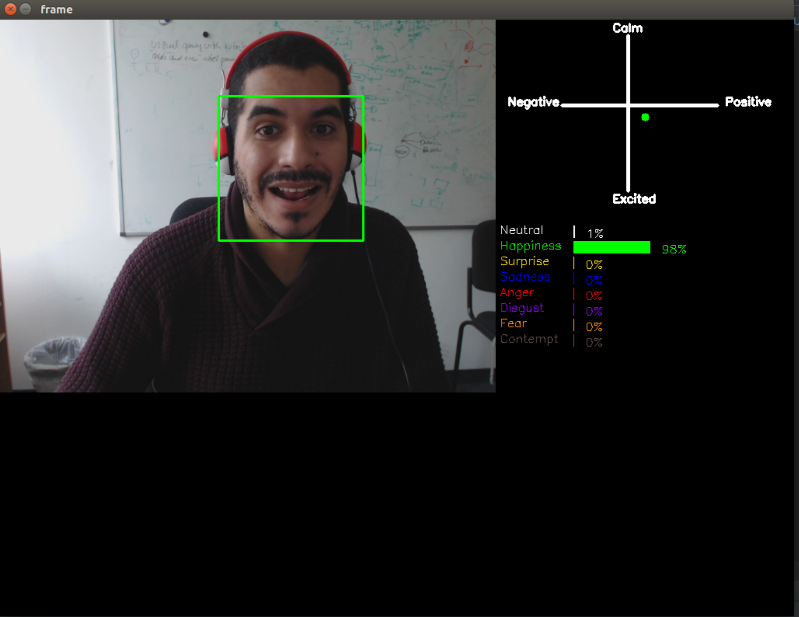

**Frame-Based Emotion Categorization**



This demos is configured to run using two different models: one for categorical emotions and other for arousal/valence intervals.


Both implemented KERAS models are based on the Face Channel of the Crosschanel CNN - more information can be found here: <br>

```sh
Barros, P., & Wermter, S. (2016). Developing crossmodal expression recognition based on a deep neural model. Adaptive behavior, 24(5), 373-396.
http://journals.sagepub.com/doi/full/10.1177/1059712316664017
```

**Requirements**

numpy, openCV-python, keras, tensorflow, dlib, h5py

If you want to run on a GPU, install tensorflow-gpu instead of tensorflow

**Instructions**


To run the demo with your own model (has to be saved as a KERAS model), add an entry on the modelDictionary.py containing the model's directory, class dictionary and type. Also, change the run.py to matche your inputsize (faceSize).


The run.py file contains all the necessary configurations. This demos runs on Python 2.7.


To run the demo just use
```sh
$ python run.py

```

**License**

All the examples in this repository are distributed under the Creative Commons CC BY-NC-SA 3.0 DE license. If you use this corpus, you have to agree with the following itens:

- To cite our reference in any of your publication that make any use of these examples. The references are provided at the end of this page.
- To use the corpus for research purpose only.
- To not provide the corpus to any second parties.


**Contact**

Pablo Barros - barros@informatik.uni-hamburg.de


